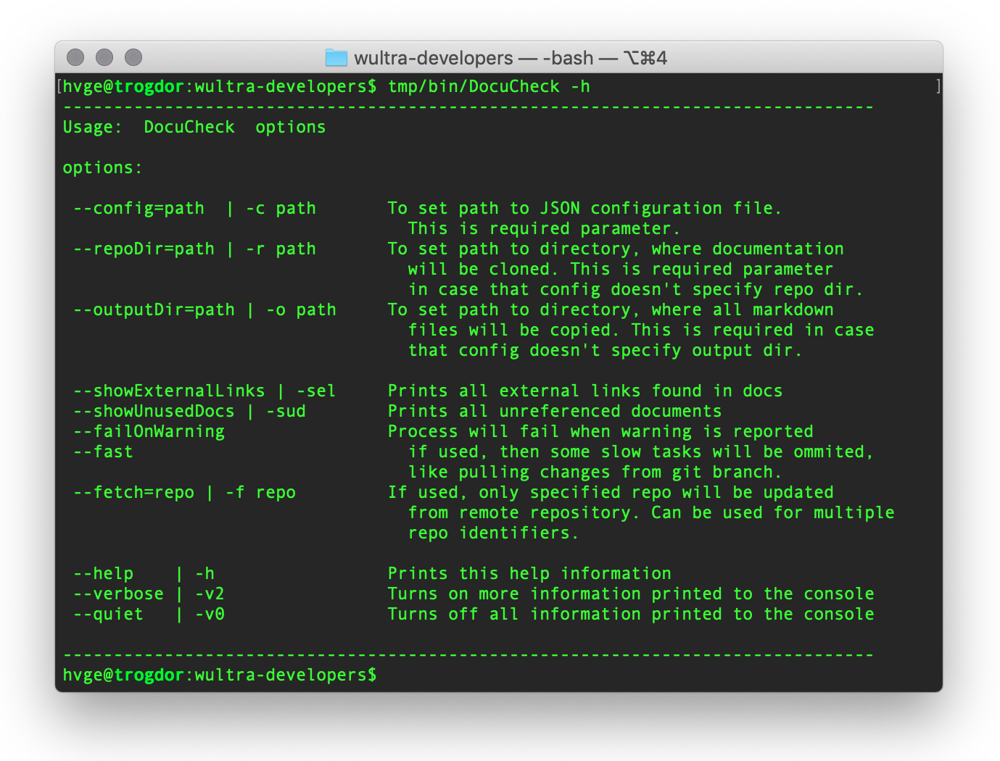

# DocuCheck Usage

This document describes all command line options supported in `DocuCheck` tool.

## Basic usage

The basic tool usage is simple. Type `DocuCheck` with a combination of parameters, for example:

```sh
$ DocuCheck -h
```

Prints embedded command's help to the console:


## Command parameters

- `-h` or `--help`
  - Prints help information embedded in the command
  
- `--config=path` or `-c path`
  - Defines `path` to [JSON configuration](Configuration-File.md) file. 
  - This parameter is **required** and cannot be omitted.

- `--repoDir=path` or `-r path`
  - Defines `path` to a repository cache directory, where all documentation source repositories will be cloned.
  - If [JSON configuration](Configuration-File.md) doesn't specify this folder, then the parameter **must be specified**. 
  
- `--outputDir=path` or `-o path`
  - Defines `path` to output folder, where all final documentation will be prepared.
  - If [JSON configuration](Configuration-File.md) doesn't specify this folder, then the parameter **must be specified**.
  
- `--showExternalLinks` or `-sel`
  - Tells `DocuCheck` to print all links to external webpages, found in the documentation.
  - This option is useful in case that you have renamed some of your projects (or you have changed email in documentation) and you want to find whether there's still link to that old repository. This kind of situation cannot be detected automatically by the tool and that's why you should print the links and do your manual check.

- `--showUnusedDocs` or `-sud`
  - Tells `DocuCheck` to print all documents in the documentation which has no reference from another documents. This is useful when you want to find unused parts of your documentation.

- `--failOnWarning`
  - If set, and some WARNING is reported, then the return code from `DocuCheck` is non-zero. This situation is then typically treated as failure in bash scripts.

- `--fast`
  - Tells `DocuCheck` to omit some slow operations, like pulling changes from a repository branches. 
  - This option is useful for situations, where you're debugging your documentation and you have already your data available locally. 
  - Note that `DocuCheck` will always perform slow operations if the required data is missing (like repo is not cloned yet, or branch in repo is not available yet)

- `--fetch=repo` or `-f repo`
  - Tells `DocuCheck` to fetch changes only for required `repo`. Other repositories will be processed like with using `--fast` switch.
  - You can use this option for multiple repositories for the same command. 

- `--verbose` or `-v2`
  - Tells `DocuCheck` to print more debug information to the console.
  - You can use this switch in case of troubles, to investigate more about what's wrong.
 
- `--quiet` or `-v0`
  - Tells `DocuCheck` to do not print information to the log at all.


## Examples

```sh
DocuCheck -c Config.json
```
> Runs docucheck with configuration which must specify a paths to a repository cache and output directory.
  
```sh
DocuCheck -c Config.json --verbose
```
> Runs docucheck with configuration which must specify a paths to a repository cache and output directory and increases verbosity of the command.

```sh
DocuCheck -c Config.json --failOnWarning ; echo $?
```
> If any WARNING is reported by the tool, then the return code from the tool will be non-zero.

```sh
DocuCheck -c Config.json --showUnusedDocs
```
> At the end of the execution prints all files with no external reference. You can find a possible unused documentation files with this option. 

```sh
DocuCheck -c Config.json --showExternalLinks
```
> At the end of the execution prints all external links found in the documentation. You can manually find suspicious links which cannot be detected automatically. For example, if you rename one of your projects, then you can check whether there's no residual link missing in the documentation. 

```sh
DocuCheck -c Config.json -f powerauth-mobile-sdk -f ssl-pinning-ios
```
> During the documentation collection, only `powerauth-mobile-sdk` and `ssl-pinning-ios` repositories will be properly updated from its remote git repositories.
